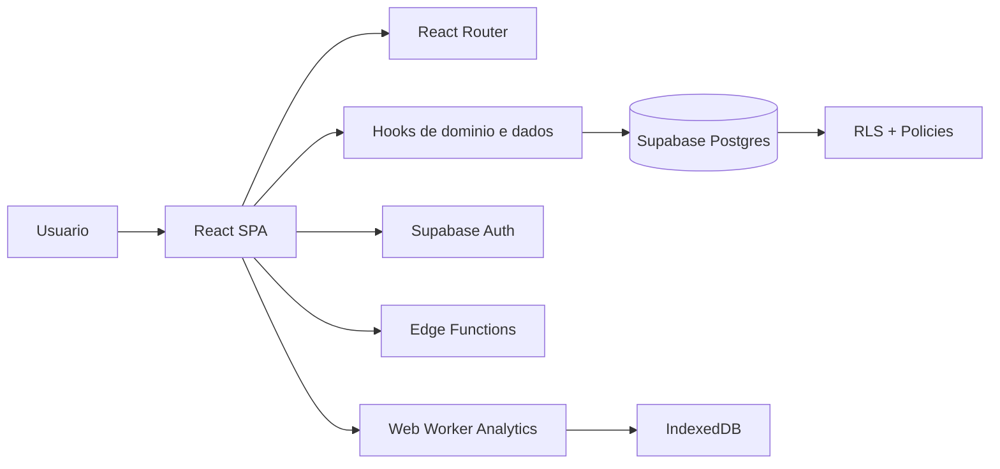
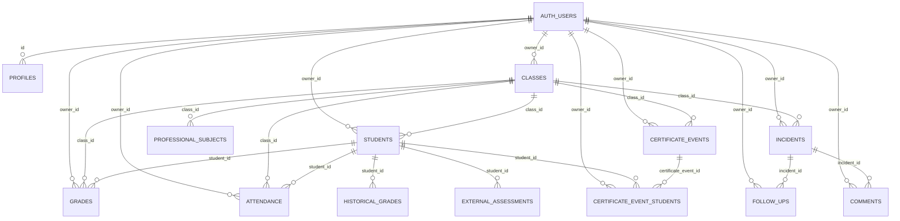

# Sistema MAVIC - Documentacao Tecnica Mestre

## Metadados do documento
- Nome do sistema: `MAVIC` (Monitoramento, Avaliacao e Visao Integrada de Classes)
- Repositorio: `acerto-disciplina`
- Branch analisada: `main`
- Commit de referencia: `latest`
- Ultima atualizacao desta documentacao: `2026-02-21`
- Idioma padrao da aplicacao: `pt-BR`
- Objetivo: descrever, de ponta a ponta, o comportamento atual do sistema e seu banco de dados

---

## 1) Visao geral do produto
O MAVIC e uma SPA React para gestao escolar com foco operacional e analitico.

Cobertura funcional principal:
- Gestao de turmas e estudantes.
- Lancamento/importacao de notas.
- Registro e acompanhamento de ocorrencias.
- Relatorios (integrados, slides, certificados).
- Trajetoria academica longitudinal.
- Analytics escolar com processamento pesado em worker.

Back-end:
- Supabase Auth + Postgres + RLS + Realtime + Edge Functions.

---

## 2) Arquitetura atual

### 2.1 Stack
- Frontend: `React 18`, `TypeScript`, `Vite`.
- UI: `Tailwind`, `shadcn/ui`, `Radix`, `lucide-react`.
- Estado remoto: hooks custom em `src/hooks/useData.ts`.
- Estado global de UI/form: `Zustand` (`useUIStore`, `useDataStore`, `useFormStore`).
- Banco e auth: `@supabase/supabase-js`.
- PDF e exportacoes: `pdfmake`, `jsPDF`, `html2canvas`, `jszip`, `qrcode`.
- Graficos: `Recharts`.
- Script headless de relatorio: `Puppeteer`.

### 2.2 Fluxo de alto nivel

### 2.3 Caracteristicas arquiteturais
- Aplicacao client-heavy: parte relevante da regra de negocio esta no frontend.
- Supabase usado como backend transacional e de seguranca (RLS).
- Realtime em entidades centrais para sincronizacao de tela.
- Estrategias de cache e dedupe para reduzir custo de fetch.

---

## 3) Rotas e telas
Fonte: `src/App.tsx`

Rotas publicas:
- `/login`: autenticacao OTP com validacao em `authorized_emails`.
- `/certificados/verificar`: validacao publica de certificado por codigo/QR.

Rotas protegidas (dentro de `AppLayout`):
- `/`: dashboard.
- `/acompanhamentos`: ocorrencias (rota oficial atual).
- `/ocorrencias`: redirect legado para `/acompanhamentos`.
- `/turmas`: gestao de turmas (**admin-only**).
- `/turmas-arquivadas`: turmas arquivadas (**admin-only**).
- `/alunos`: gestao de estudantes (**admin-only**).
- `/notas-frequencia`: pagina de notas (**admin-only**).
- `/relatorios-integrados`: relatorios integrados.
- `/slides`: slides de apresentacao.
- `/certificados`: certificados.
- `/relatorios`: redirect legado para as rotas novas (query `tab` -> rota dedicada).
- `/analytics`: painel analitico.
- `/trajetoria`: visao longitudinal.
- `/usuarios`: gestao de usuarios (**admin-only**).

Detalhe importante de navegacao:
- A estrutura de relatorios foi migrada de abas para paginas dedicadas.
- Compatibilidade legado mantida via redirect de `/relatorios`.

---

## 4) Modulos funcionais

### 4.1 Dashboard
- KPIs operacionais gerais.
- Atalhos de navegacao.
- Acesso a configuracao escolar (`school_config`).
- Card de aniversariantes com dialog explorador:
  - abas `Proximos` e `Passados`
  - busca por aluno/turma
  - filtros de janela temporal (30, 90, 365 dias)
  - calculo de datas em horario de Brasilia
- Card `Atividade Recente`:
  - CTA `Ver todas` abre dialog no proprio dashboard.
  - Escopo por perfil:
    - `admin`: todas as turmas
    - `diretor`: apenas turmas dirigidas (`director_id`/`director_email`)
    - `professor`: card omitido
- Busca global na TopBar (`Ctrl+K`/`Cmd+K`) com resultados sensiveis a permissao.

### 4.2 Turmas
- CRUD de turmas.
- Campos academicos e ciclo (`start_calendar_year`, `end_calendar_year`, `archived`).
- Vinculo de direcao por `director_id` e/ou `director_email`.
- Integracao com templates de disciplinas profissionais.
- Acesso restrito a perfil `admin` (UI + guard de rota).

### 4.3 Alunos
- CRUD e movimentacao entre turmas.
- Campos cadastrais completos (matricula, CPF, RG, status etc.).
- Acesso restrito a perfil `admin` (UI + guard de rota).

### 4.4 Notas
- Lancamento manual por turma/aluno/disciplina/bimestre.
- Uso de `upsert` e agregacoes para analytics.
- Importacao via parser SIGE.
- Acesso restrito a perfil `admin` (UI + guard de rota).

### 4.5 Ocorrencias
- Wizard de registro.
- Severidade calculada e severidade final com justificativa de override.
- Ciclo de vida: `aberta` -> `acompanhamento` -> `resolvida`.
- Follow-ups e comentarios estruturados.

### 4.6 Relatorios
- Relatorios integrados.
- Slides de apresentacao.
- Certificados com snapshot persistido + reprocessamento posterior.

### 4.7 Analytics
- Filtros por serie/turma/disciplina/periodo.
- Processamento em worker para nao bloquear UI.
- Cache em IndexedDB.
- Segmentacao oficial de convivência:
  - **Convivência Disciplinar**: considera somente `incident_type = disciplinar`.
  - **Convivência Familiar**: considera somente `incident_type = acompanhamento_familiar`.
  - A aba de Analytics foi dividida para evitar mistura de contextos.
  - Sem migracao legada: a separacao ocorre por regra de calculo.
- Contrato de insights (v2026-02):
  - Insights de convivência são exibidos em bloco unico por aba (sem duplicacao entre componentes).
  - Geração baseada em regras acionáveis (pendências críticas, concentração grave, turma fora da curva, piora de tendência).
  - Coleções de insights são deduplicadas por chave semântica e ordenadas por prioridade.
  - “Destaques Importantes” do dashboard usa política de evidência mínima para crescimento/queda.

### 4.8 Trajetoria academica
- Cruzamento de notas regulares, historicas e externas.
- Leitura longitudinal por aluno/turma.

### 4.9 Usuarios
- Gestao de acessos e papeis com suporte por Edge Function.

---

## 5) Estado e sincronizacao

### 5.1 `useData` (core)
Arquivo: `src/hooks/useData.ts`

Responsabilidades:
- Fetch e mutacoes das entidades principais (`classes`, `students`, `grades`, `incidents`, etc.).
- Realtime subscriptions.
- Cache em memoria e dedupe de requests concorrentes.
- RPC de analytics (`fetch_grades_analytics`) quando aplicavel.

### 5.2 Stores Zustand
- `src/stores/useUIStore.ts`: persistencia de filtros e abas por pagina.
- `src/stores/useDataStore.ts`: estado de dados compartilhados.
- `src/stores/useFormStore.ts`: persistencia de formularios.

### 5.3 Convencoes
- Filtros e tabs persistidos em `localStorage`.
- UI default em portugues (`document.documentElement.lang = 'pt-BR'` em `src/main.tsx`).

---

## 6) Certificados (estado atual detalhado)

### 6.1 Tipos suportados
- `monitoria`
- `destaque`
- `evento_participacao`
- `evento_organizacao`

### 6.2 Fluxo de geracao (Dialog Unificado)
Arquivos principais:
- `src/components/reports/CertificatesReports.tsx` (pagina host)
- `src/components/reports/certificates/UnifiedCertificateDialog.tsx` (dialog unico multi-step)
- `src/components/reports/certificates/CertificateDialogStepper.tsx` (stepper visual)
- `src/components/reports/certificates/steps/CertificateContextStep.tsx` (etapa: turma e parametros)
- `src/components/reports/certificates/steps/CertificateFinishStep.tsx` (etapa: assinatura e padrao visual)
- `src/components/reports/certificates/CertificateTextEditor.tsx` (editor de texto base + overrides)
- `src/components/reports/certificates/StudentsSelector.tsx` (selecao de alunos)

Fluxo multi-step:
1. **Tipo**: usuario escolhe entre Monitoria, Destaque, Evento Participacao ou Evento Organizacao.
2. **Contexto**: seleciona turma, periodo (bimestres ou anual), referencia (disciplina/area), dados do evento/monitoria.
3. **Alunos**: selecao dos destinatarios.
4. **Texto**: previa e edicao do template com override por aluno.
5. **Exportar**: configuracao de assinatura, padrao visual da faixa lateral e download.

Ao confirmar:
- Salva snapshot (`certificate_events` + `certificate_event_students`) via `onSaveEvent`.
- Codigos de verificacao sao gerados e associados a cada aluno.
- Dispara download do PDF (unico ou ZIP individual).

### 6.3 Layout do PDF
Arquivo central: `src/lib/certificatePdfExport.ts`

Layout paisagem com camadas:
1. **Fundo branco** (`#F8FAFC`)
2. **Faixa lateral esquerda** (140px, cor da escola via `school_config.theme_color`)
3. **Padrao SVG geometrico** sobre a faixa (3 opcoes selecionaveis pelo usuario):
   - `chevrons`: linhas em V repetidas (corporativo)
   - `hexagons`: grid de hexagonos wireframe (tech/moderno)
   - `diagonal_lines`: riscos finos a 45 graus (minimalista)
4. **Gradiente de profundidade** vertical sobre a faixa
5. **Moldura lateral opcional** (asset da escola em `school-assets`, aplicado apenas na faixa esquerda)
6. **Header**: logo da escola ao lado do titulo "CERTIFICADO DE [TIPO]"
7. **Corpo**: nome do aluno, texto do certificado, data de emissao
8. **Assinaturas**: cursiva digital acima da linha, nome impresso e subtitulo abaixo
9. **QR Code**: selo de verificacao no canto superior direito, codigo discreto em fonte 6px

Capacidades de export:
- Geracao por aluno (`generateCertificateFiles`).
- Geracao de PDF unico com varias paginas (`generateCombinedCertificatePdf`).
- Download individual/ZIP (`downloadCertificateFiles`, `downloadCombinedCertificatePdf`).
- Uso de: logo, moldura lateral (opcional), assinatura da direcao, assinatura do professor, QR + codigo por aluno.

### 6.4 Templates de texto
Arquivo: `src/lib/certificateTemplates.ts`

Cada tipo tem template com placeholders (`{{aluno}}`, `{{turma}}`, `{{periodo}}`, `{{referencia}}`, etc.).
Escolha de referencia usa `src/lib/certificateRules.ts` para resolver disciplinas e areas por turma.
Periodos formatados por `src/lib/certificatePeriods.ts` (inclui ano corrente automatico).

### 6.5 Lista de certificados salvos
Arquivos:
- `src/components/reports/certificates/SavedCertificateEventsTable.tsx`
- `src/components/reports/certificates/SavedCertificateEventDialog.tsx`
- `src/hooks/useCertificateEvents.ts`

Capacidades:
- Busca, filtro por tipo, selecao multipla.
- Download por evento, por aluno, por subconjunto e em lote (ZIP unico com pastas por evento).
- Exclusao definitiva com confirmacao.

### 6.6 Verificacao publica
- Rota: `/certificados/verificar`
- Fonte: `src/pages/CertificateVerification.tsx`
- Backend: RPC `public.verify_certificate_code(p_code text)`
- Resultado esperado: status (`valid`/`revoked`) + dados essenciais do certificado.

### 6.7 Pre-requisito de schema para QR (obrigatorio)
Para o fluxo atual (sem legado), certificados dependem de:
- Coluna `verification_code` em `public.certificate_event_students`.
- Coluna `verification_status` em `public.certificate_event_students`.
- Funcao `public.verify_certificate_code(text)`.

Migration obrigatoria:
- `supabase/migrations/2026-02-22_certificate_verification_and_signature.sql`

Sintoma de ambiente desatualizado:
- Erro `Could not find the 'verification_code' column of 'certificate_event_students' in the schema cache`.

Checklist rapido de troubleshooting:
1. Aplicar migrations incrementais em ordem no SQL Editor (nao apenas `schema.sql`).
2. Executar `NOTIFY pgrst, 'reload schema';`.
3. Confirmar colunas e indices em `information_schema.columns` e `pg_indexes`.
4. Validar RPC `public.verify_certificate_code`.

---

## 7) Banco de dados Supabase (visao profunda)

Fonte principal consolidada:
- `supabase/schema.sql`
- `supabase/migrations/*.sql`

### 7.1 Catalogo de tabelas por dominio

#### Acesso e identidade

`public.authorized_emails`
- PK: `email`
- Campos: `role`, `created_at`
- Uso: whitelist para login OTP e fallback de role.

`public.profiles`
- PK/FK: `id` -> `auth.users(id)`
- Campos: `name`, `role`, timestamps
- Uso: perfil principal da aplicacao.

#### Estrutura escolar e cadastro

`public.classes`
- PK: `id`
- FK: `owner_id` -> `auth.users`, `director_id` -> `profiles`
- Campos centrais:
  - identidade da turma: `name`, `series`, `letter`, `course`
  - direcao: `director_id`, `director_email`
  - ciclo: `start_year`, `current_year`, `start_calendar_year`, `end_calendar_year`
  - estado: `active`, `archived`, `archived_at`, `archived_reason`

`public.students`
- PK: `id`
- FK: `owner_id` -> `auth.users`, `class_id` -> `classes`
- Campos centrais: `name`, `birth_date`, `gender`, `enrollment`, `cpf`, `rg`, `status`.

`public.school_config`
- PK fixa singleton: `id = 00000000-0000-0000-0000-000000000000`
- Campos centrais: identidade escolar, contato, diretor, logo, assinatura, cor tema.
- Assets de identidade visual:
  - `logo_storage_path` (Supabase Storage privado, bucket `school-assets`)
  - `certificate_frame_storage_path` (moldura lateral de certificados)
  - Fallback legado de logo em `logo_base64` para compatibilidade.

#### Academico

`public.grades`
- PK: `id`
- FKs: `owner_id`, `student_id`, `class_id`
- Checks:
  - `school_year` entre 1 e 3
  - `grade` entre 0 e 10
- Campos: `subject`, `quarter`, `observation`, timestamps.

`public.attendance`
- PK: `id`
- FKs: `owner_id`, `student_id`, `class_id`, `recorded_by`
- Check `status`: `presente|falta|falta_justificada|atestado`.

`public.professional_subject_templates`
- PK: `id`
- FK: `owner_id`
- Campos: `name`, `course`, `subjects_by_year (jsonb)`.

`public.professional_subjects`
- PK: `id`
- FK: `owner_id`, `class_id`
- Campos: `subject`.

#### Ocorrencias

`public.incidents`
- PK: `id`
- FKs: `owner_id`, `class_id`, `validated_by`, `created_by`
- Campos centrais:
  - `incident_type`: `disciplinar|acompanhamento_familiar`
  - `student_ids (uuid[])`, `episodes (text[])`
  - severidades calculada/final
  - `status`: `aberta|acompanhamento|resolvida`

`public.follow_ups`
- PK: `id`
- FKs: `owner_id`, `incident_id`, `created_by`
- Check `type`: `conversa_individual|conversa_pais|situacoes_diversas`.

`public.comments`
- PK: `id`
- FKs: `owner_id`, `incident_id`, `user_id`
- Campos: `user_name`, `text`, `created_at`.

#### Trajetoria longitudinal

`public.historical_grades`
- PK: `id`
- FK: `student_id`
- Check `grade` entre 0 e 10
- Campos: `school_level`, `grade_year`, `calendar_year`, `quarter`, `subject`, `school_name`.

`public.external_assessments`
- PK: `id`
- FK: `student_id`
- Campos centrais: `assessment_type`, `assessment_name`, `score`, `max_score`, `temporal_position (jsonb)`.

#### Certificados persistidos

`public.certificate_events`
- PK: `id`
- FKs: `owner_id` -> `auth.users`, `class_id` -> `classes` (on delete set null)
- Checks:
  - `certificate_type` em `monitoria|destaque|evento_participacao|evento_organizacao`
  - `school_year` entre 1 e 3
  - `period_mode` em `quarters|annual`
  - `signature_mode` em `digital_cursive|physical_print`
  - `students_count >= 0`
- Campos centrais:
  - contexto congelado: turma, periodo, referencia
  - conteudo: `base_text`, `type_meta (jsonb)`
  - autoria: `created_by_name`, `teacher_name`, `director_name`

`public.certificate_event_students`
- PK: `id`
- FKs: `owner_id`, `certificate_event_id` (on delete cascade), `student_id` (on delete set null)
- Checks:
  - `highlight_status` em `confirmed|pending`
  - `verification_status` em `valid|revoked`
- Campos centrais:
  - snapshot do aluno: `student_name_snapshot`
  - customizacao: `text_override`
  - validacao: `verification_code` unico, `verification_status`

### 7.2 Relacionamentos principais

### 7.3 Funcoes SQL relevantes
`public.current_app_role()`
- Resolve role a partir de `profiles` com fallback em `authorized_emails`.

`public.is_director_of_class(target_class_id uuid)`
- Verifica se usuario atual e diretor da turma.

`public.can_manage_incident_class(target_class_id uuid)`
- Regra central de permissao para gerenciamento de ocorrencias.

`public.fetch_grades_analytics(class_ids, student_id, quarter, school_year)`
- Retorna JSON agregado de notas para analytics.

`public.verify_certificate_code(p_code text)`
- RPC publica (security definer) para validacao de certificado por codigo.
- Grants: `anon`, `authenticated`.

### 7.4 Indices relevantes (migrations recentes)
- `grades_class_year_quarter_idx`
- `grades_student_year_quarter_idx`
- `incidents_type_class_date_idx`
- `certificate_events_owner_created_at_idx`
- `certificate_events_type_created_at_idx`
- `certificate_events_class_created_at_idx`
- `certificate_event_students_event_idx`
- `certificate_event_students_owner_idx`
- `certificate_event_students_verification_code_uidx`
- `certificate_event_students_verification_status_idx`

---

## 8) RLS e autorizacao (estado atual)

### 8.1 Regras de papel
Papeis em uso:
- `admin`
- `diretor`
- `professor`

### 8.2 Matriz resumida de acesso (migracoes recentes)

`classes` (`2026-02-09_z_classes_admin_rls.sql`):
- `select`: autenticado
- `insert/update/delete`: apenas `admin` (com `owner_id = auth.uid()` no insert)

`incidents`, `follow_ups`, `comments` (`2026-02-09_incidents_role_rls.sql`):
- `select`: autenticado
- `insert`:
  - incidents: `admin|diretor|professor`, com owner e created_by do proprio usuario
  - follow_ups/comments: exigem capacidade de gerenciamento da turma via `can_manage_incident_class`
- `update/delete`: gerenciamento condicionado a `can_manage_incident_class`

`certificate_events` e `certificate_event_students` (`2026-02-21_certificate_events.sql`):
- `select`: `admin` ve tudo; demais apenas `owner_id = auth.uid()`
- `insert`: somente proprio owner
- `update/delete`: `admin` ou dono do registro

### 8.3 Observacao
- Este documento prioriza politicas explicitamente registradas em migrations recentes do repositorio.
- Para tabelas com politicas antigas nao documentadas aqui, conferir historico completo de migrations em ambiente Supabase.

---

## 9) Migrations relevantes (linha do tempo)

- `2025-01-22_analytics_grades_rpc.sql`
  - Cria `fetch_grades_analytics`.
- `2025-01-22_grades_analytics_indexes.sql`
  - Indices para filtros de analytics de notas.
- `2026-02-09_incidents_role_rls.sql`
  - Funcoes de papel e hardening RLS de ocorrencias.
- `2026-02-09_z_classes_admin_rls.sql`
  - RLS de turmas restrito a admin para escrita.
- `2026-02-20_incidents_type.sql`
  - Introduz `incident_type` + indice.
- `2026-02-21_certificate_events.sql`
  - Cria snapshot persistido de certificados + RLS.
- `2026-02-22_certificate_verification_and_signature.sql`
  - Adiciona assinatura por modo, codigo de verificacao e RPC publica de validacao.
- `2026-02-23_school_config_storage_paths.sql`
  - Adiciona paths de Storage para logo e moldura lateral em `school_config`.
- `2026-02-23_storage_school_assets_bucket.sql`
  - Cria/configura bucket privado `school-assets` e policies em `storage.objects`.

---

## 10) Relatorios (detalhes operacionais)

### 10.1 Integrados
Arquivo: `src/components/reports/IntegratedReports.tsx`
- Relatorios por aluno/turma/trajetoria.
- Montagem condicional por aba ativa.

### 10.2 Slides
Arquivo: `src/components/reports/ClassSlides.tsx`
- Modos de geracao por recorte (turma, individual, situacao, escola).

### 10.2.1 Tendencia mensal em convivência
- As series mensais de convivência (disciplinar e familiar) usam `monthLabel` (`MMM/AA`) no eixo X.
- Motivo: evitar colisoes de rótulo em intervalos que cruzam anos (ex.: Jan/25 vs Jan/26).

### 10.3 Certificados
Arquivos principais:
- `src/components/reports/CertificatesReports.tsx`
- `src/components/reports/certificates/*`
- `src/hooks/useCertificateEvents.ts`
- `src/lib/certificateEventTypes.ts`
- `src/lib/certificatePdfExport.ts`
- `src/lib/certificateTemplates.ts`

Hardening aplicado:
- `CertificatesErrorBoundary` evita tela branca no modulo.
- Dialog de detalhe (`SavedCertificateEventDialog`) blindado para `event = null`.

---

## 11) Edge Functions e integracoes

### 11.1 `create-user`
Arquivo: `supabase/functions/create-user/index.ts`
- Cria/atualiza/remove usuarios com validacao de role.

### 11.2 `send-incident-email`
Arquivo: `supabase/functions/send-incident-email/index.ts`
- Notifica eventos de ocorrencia por SMTP.

---

## 12) Operacao local

### 12.1 Requisitos
- Node.js compativel com projeto.
- Env vars:
  - `VITE_SUPABASE_URL`
  - `VITE_SUPABASE_ANON_KEY`

### 12.2 Comandos
- `npm install`
- `npm run dev`
- `npm run build`
- `npm run lint`
- `npm run preview`
- `npm run report`

### 12.3 Localizacao e idioma
- `index.html`: `lang="pt-BR"`
- `src/main.tsx`: reforco de `document.documentElement.lang = 'pt-BR'`

---

## 13) Mapa de arquivos criticos

### 13.1 App shell e rotas
- `src/App.tsx`
- `src/main.tsx`
- `src/components/layout/AppLayout.tsx`

### 13.2 Dados e estado
- `src/hooks/useData.ts`
- `src/hooks/useCertificateEvents.ts`
- `src/stores/useUIStore.ts`
- `src/stores/useDataStore.ts`
- `src/stores/useFormStore.ts`
- `src/services/supabase/client.ts`

### 13.3 Relatorios/certificados
- `src/pages/Reports.tsx`
- `src/components/reports/IntegratedReports.tsx`
- `src/components/reports/ClassSlides.tsx`
- `src/components/reports/CertificatesReports.tsx`
- `src/components/reports/certificates/UnifiedCertificateDialog.tsx`
- `src/components/reports/certificates/CertificateDialogStepper.tsx`
- `src/components/reports/certificates/steps/CertificateContextStep.tsx`
- `src/components/reports/certificates/steps/CertificateFinishStep.tsx`
- `src/components/reports/certificates/CertificateTextEditor.tsx`
- `src/components/reports/certificates/StudentsSelector.tsx`
- `src/components/reports/certificates/SavedCertificateEventsTable.tsx`
- `src/components/reports/certificates/SavedCertificateEventDialog.tsx`
- `src/lib/certificatePdfExport.ts`
- `src/lib/certificateTemplates.ts`
- `src/lib/certificatePeriods.ts`
- `src/lib/certificateRules.ts`
- `src/lib/certificateEventTypes.ts`

### 13.4 Banco e backend
- `supabase/schema.sql`
- `supabase/migrations/*.sql`
- `supabase/functions/create-user/index.ts`
- `supabase/functions/send-incident-email/index.ts`

---

## 14) Limitacoes e divida tecnica
- `src/hooks/useData.ts` concentra muita responsabilidade.
- Alguns modulos ainda grandes (ex.: `ClassSlides`, `StudentTrajectory`).
- Frequencia existe em banco, mas cobertura funcional na UI segue parcial.
- Persistencia de snapshot de certificados nao inclui arquivo PDF (somente dados para regeneracao).
- Dialogs antigos de certificado (`MonitoriaCertificateDialog`, `HighlightCertificateDialog`, `EventCertificateDialog`) foram substituidos pelo `UnifiedCertificateDialog` e podem ser removidos se ainda presentes.

---

## 15) Regra de manutencao deste documento
Sempre que houver alteracao de:
- schema/migration/policies/RPC,
- fluxo critico de negocio,
- contratos publicos de hooks/tipos,
- rotas e comportamento de telas,

atualizar `SISTEMA.md` no mesmo PR.

Checklist minimo por PR:
1. Atualizou metadados (`commit`, `data`)?
2. Atualizou secoes de banco e RLS quando aplicavel?
3. Atualizou mapa de arquivos impactados?
4. Registrou riscos/regressoes conhecidos?
