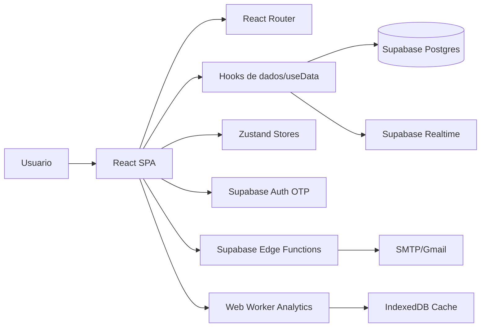
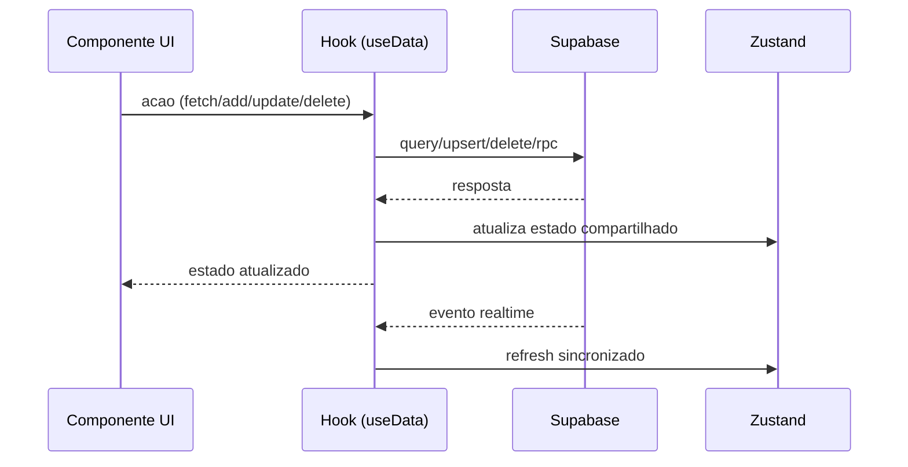
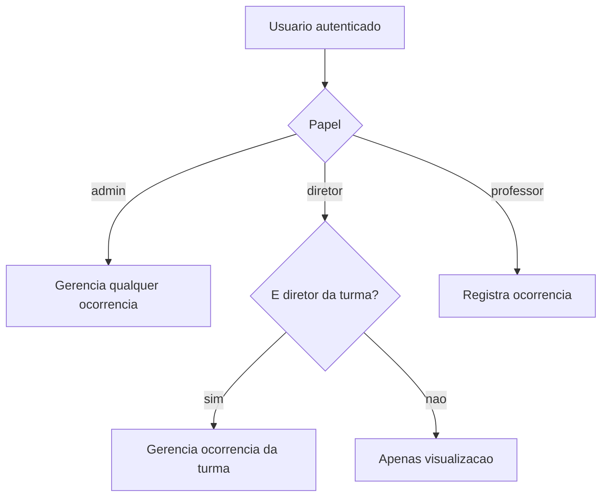
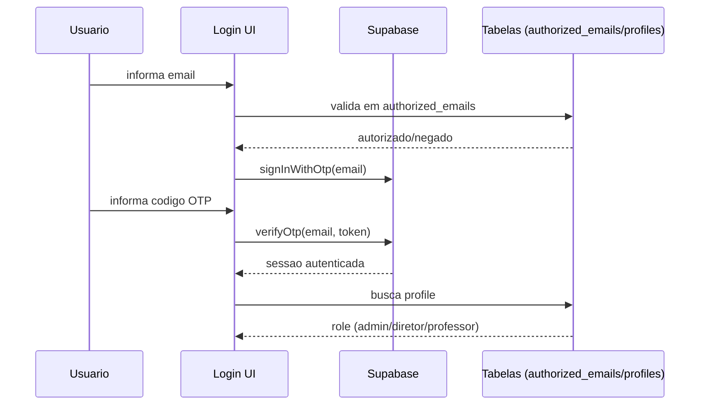
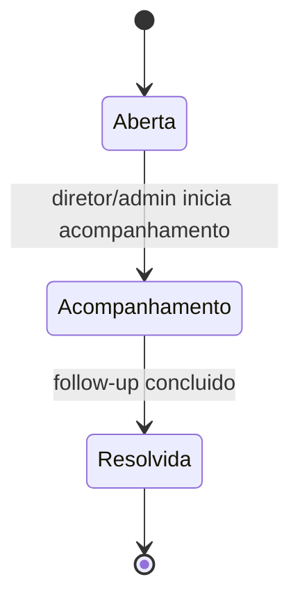
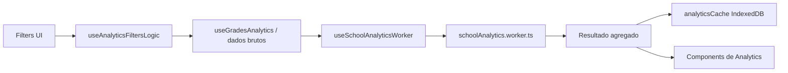

# Sistema MAVIC - Documentacao Tecnica Mestre

## Metadados do documento
- Nome do sistema: `MAVIC` (Monitoramento, Avaliacao e Visao Integrada de Classes)
- Repositorio: `acerto-disciplina`
- Branch analisada: `main`
- Commit de referencia: `86296f3`
- Ultima atualizacao desta documentacao: `2026-02-17`
- Publico principal: onboarding tecnico de desenvolvimento
- Objetivo: servir como fonte unica para entender o sistema sem reler o projeto inteiro

## Sumario
1. Visao geral do produto
2. Escopo funcional por modulo
3. Arquitetura da aplicacao
4. Rotas e responsabilidade de cada tela
5. Camada de dados, estado e sincronizacao
6. Modelo de dados (Supabase)
7. Autenticacao, autorizacao e RLS
8. Fluxos criticos de negocio
9. Analytics e processamento pesado
10. Trajetoria academica (longitudinal)
11. Relatorios e exportacoes
12. Importacoes (SIGE e historico)
13. Edge Functions e integracoes externas
14. UI, tema e design system
15. Observabilidade e performance
16. Limitacoes atuais e divida tecnica
17. Operacao local e configuracao
18. Mapa de arquivos criticos
19. Checklist de manutencao continua
20. Glossario rapido

---

## 1) Visao geral do produto
O MAVIC e uma SPA React para gestao escolar com foco operacional e analitico em:
- Turmas, alunos e estrutura academica.
- Lancamento e importacao de notas.
- Ocorrencias disciplinares com ciclo de acompanhamento.
- Relatorios (documentos PDF, visoes integradas e slides).
- Analytics institucional.
- Trajetoria longitudinal por aluno/turma (fundamental + medio + avaliacoes externas).

O sistema usa Supabase como backend (Auth, Postgres, Realtime e Edge Functions).

---

## 2) Escopo funcional por modulo

### 2.1 Dashboard
- Visao resumida operacional.
- Indicadores de alunos/turmas/ocorrencias pendentes.
- Atalhos de navegacao para todos os modulos.
- Widgets de aniversariantes e atividade recente.
- Acesso a configuracao institucional (`school_config`).

### 2.2 Turmas
- Cadastro, edicao e exclusao de turmas.
- Vinculo de diretor por `director_id` e/ou `director_email`.
- Arquivamento e desarquivamento com motivo.
- Controle de templates de disciplinas profissionais por curso/ano.
- Bloqueios de operacao em cenarios disciplinares (ex.: turma com ocorrencias).

### 2.3 Alunos
- Cadastro individual e importacao em lote.
- Campos cadastrais completos (nome, data nasc., genero, matricula, CPF, RG etc.).
- Transferencia entre turmas.
- Status academico (active/inactive/transferred/approved/recovery/failed).
- Aba de aprovacoes e gerenciamento de desempenho.

### 2.4 Notas
- Lancamento manual por turma/aluno/disciplina/bimestre/ano.
- Persistencia por `upsert` com chave logica composta.
- Importacao SIGE via assistente multi-etapas (matching de alunos/disciplina + preview + commit).

### 2.5 Frequencia (estado atual)
- Estrutura de dados existe (`attendance`), mas recurso esta desativado em varias telas.
- A pagina `notas-frequencia` opera apenas com notas no estado atual.

### 2.6 Ocorrencias
- Registro por wizard com contexto/alunos/episodios/detalhes/revisao.
- Classificacao de severidade calculada + severidade final com justificativa de override.
- Status de ciclo de vida: `aberta`, `acompanhamento`, `resolvida`.
- Follow-ups estruturados e comentarios.
- Disparo de email ao diretor da turma.
- Geracao de PDF de ocorrencia e notificacao aos responsaveis.

### 2.7 Relatorios
- Relatorios integrados (aluno/turma/trajetoria).
- Slides de apresentacao (modo turma, individual, situacao e escola).
- Geração PDF client-side e tambem script headless com Puppeteer.

### 2.8 Analytics
- Filtros densos por serie, turma, disciplina, bimestre, ano escolar e ano calendario.
- Rankings por turma/aluno, analise disciplinar e comportamental.
- Processamento pesado em Web Worker.
- Cache de analytics em IndexedDB.

### 2.9 Trajetoria academica
- Visao longitudinal por aluno e visao macro por turma.
- Integracao de notas regulares, notas historicas e avaliacoes externas.
- Simulacoes de cenario e indicadores de tendencia.
- Importacao em lote de historico academico.

### 2.10 Usuarios (admin)
- Gestao de acessos autorizados (`authorized_emails`) e perfis.
- Operacoes create/update/delete via Edge Function `create-user`.

---

## 3) Arquitetura da aplicacao

### 3.1 Stack principal
- Frontend: `React 18`, `TypeScript`, `Vite`.
- UI: `Tailwind`, `shadcn/ui`, `Radix`, `Lucide`.
- Estado remoto/local: hooks custom + `Zustand`.
- Servicos de dados: `@supabase/supabase-js`.
- Graficos: `Recharts`.
- Exportacao: `pdfmake`, `jsPDF`, `html2canvas`.
- Parsing Excel: `xlsx`.
- Relatorio headless: `Puppeteer` (script).

### 3.2 Diagrama de arquitetura (alto nivel)

### 3.3 Principios arquiteturais observados
- App client-heavy com regras de negocio relevantes no frontend.
- Backend centralizado em tabelas e RLS do Supabase.
- Atualizacao em tempo real por canais Supabase.
- Otimizacoes de carga: cache por escopo + controle de inflight + paginacao.
- Modulos grandes concentrando muita responsabilidade (ver secao de divida tecnica).

---

## 4) Rotas e responsabilidade de cada tela

Fonte: `src/App.tsx`.

- `/login`
  - Fluxo OTP com whitelist em `authorized_emails`.
- `/`
  - Dashboard principal.
- `/analytics`
  - Painel analitico avancado.
- `/ocorrencias`
  - Lista e gerenciamento de ocorrencias.
- `/turmas`
  - Gestao de turmas + templates + criacao.
- `/turmas-arquivadas`
  - Historico de turmas arquivadas e restauracao.
- `/alunos`
  - Gestao, cadastro e aprovacoes.
- `/notas-frequencia`
  - Notas (frequencia temporariamente removida da UI principal).
- `/trajetoria`
  - Trajetoria academica longitudinal.
- `/relatorios`
  - Relatorios integrados e slides.
- `/usuarios`
  - Gestao de usuarios (somente admin).

Todas as rotas internas sao protegidas por `ProtectedRoute`.

---

## 5) Camada de dados, estado e sincronizacao

### 5.1 Hooks de dados (arquivo central)
Arquivo critico: `src/hooks/useData.ts` (grande concentrador do sistema).

Hooks publicos principais:
- `useProfiles`
- `useAuthorizedEmails`
- `useClasses`
- `useStudents`
- `useGrades`
- `useGradesScoped`
- `useGradesAnalytics`
- `useAttendance`
- `useIncidents`
- `useProfessionalSubjects`
- `useProfessionalSubjectTemplates`
- `useArchivedClasses`
- `useHistoricalGradesScoped`
- `useHistoricalGrades`
- `useHistoricalGradesAnalytics`
- `useExternalAssessmentsScoped`
- `useExternalAssessments`

Caracteristicas relevantes:
- Cache em memoria por escopo/chave de consulta.
- Dedupe de chamadas concorrentes via mapas de inflight.
- Realtime subscriptions por tabela (profiles, classes, students, grades, incidents, etc.).
- Operacoes de `upsert` para reduzir atrito de concorrencia.
- Mecanismo de paginação para conjuntos grandes (especialmente notas).
- Uso de RPC agregada para analytics (`fetch_grades_analytics`) com fallback.

### 5.2 Estado global compartilhado (`Zustand`)
- `useDataStore.ts`
  - Guarda arrays principais e flags `loaded/fetching` por entidade.
- `useUIStore.ts`
  - Persiste filtro/tab por tela (analytics, ocorrencias, relatorios, trajetoria, etc.) em `localStorage`.
- `useFormStore.ts`
  - Persiste dados de formularios entre navegacoes.

### 5.3 Fluxo de dados (resumo)

---

## 6) Modelo de dados (Supabase)

### 6.1 Tabelas principais
- `profiles`
  - Perfil do usuario autenticado (`id`, `name`, `role`).
- `authorized_emails`
  - Whitelist de acesso com papel.
- `classes`
  - Turmas, curso, letra, diretor, ano de inicio/fim, estado de arquivamento.
- `students`
  - Cadastro do aluno e status.
- `grades`
  - Notas por aluno/turma/disciplina/bimestre/ano escolar.
- `attendance`
  - Frequencia por data/status (estrutura presente, UI parcialmente desativada).
- `incidents`
  - Registro disciplinar com severidade e status.
- `follow_ups`
  - Acompanhamentos vinculados a ocorrencias.
- `comments`
  - Comentarios por ocorrencia.
- `professional_subject_templates`
  - Templates de disciplinas por curso e ano.
- `professional_subjects`
  - Disciplinas profissionais atreladas a turma.
- `historical_grades`
  - Notas de historico escolar (fundamental/medio).
- `external_assessments`
  - Avaliacoes externas longitudinalmente posicionadas.
- `school_config`
  - Config institucional unica (id fixo).

### 6.2 Constraints relevantes
- `grades.grade` em faixa 0..10.
- `grades.school_year` em faixa 1..3.
- Unicidade logica de nota por aluno/turma/disciplina/bimestre/ano via migration.
- `incidents.status` limitado a `aberta|acompanhamento|resolvida`.
- `incidents.final_severity` e `calculated_severity` limitadas ao enum textual.

### 6.3 Indices e RPC para analytics
- Indices:
  - `grades_class_year_quarter_idx`
  - `grades_student_year_quarter_idx`
- RPC:
  - `fetch_grades_analytics(class_ids, student_id, quarter, school_year)` retorna JSON agregado de notas.

---

## 7) Autenticacao, autorizacao e RLS

### 7.1 Autenticacao
- Login por email OTP (`signInWithOtp` + `verifyOtp`) na tela de login.
- Antes de enviar OTP, o email precisa existir em `authorized_emails`.

### 7.2 Perfis e papeis
- Papeis esperados: `admin`, `diretor`, `professor`.
- `AuthContext` carrega `profiles`; se ausente, usa fallback de `user_metadata`.
- Regras de interface:
  - `admin`: acesso total + gestao de usuarios.
  - `diretor`: gerenciamento condicionado a vinculo de turma.
  - `professor`: acesso operacional restrito em fluxos sensiveis de ocorrencia.

### 7.3 RLS e funcoes auxiliares (migrations 2026-02-09)
- Funcoes de apoio:
  - `current_app_role()`
  - `is_director_of_class(target_class_id)`
  - `can_manage_incident_class(target_class_id)`
- Politicas de ocorrencias:
  - Select autenticado.
  - Insert permitido por papel com `owner_id = auth.uid()` e `created_by = auth.uid()`.
  - Update/Delete condicionado a `can_manage_incident_class`.
- Politicas de turmas (hardening):
  - Select autenticado.
  - Insert/Update/Delete restritos a `admin`.

### 7.4 Diagrama de permissao (incidentes)

---

## 8) Fluxos criticos de negocio

### 8.1 Fluxo de ocorrencia disciplinar
1. Usuario abre wizard de nova ocorrencia.
2. Seleciona turma, alunos e episodios.
3. Severidade calculada automaticamente.
4. Pode haver override de severidade com justificativa obrigatoria.
5. Registro salvo com status inicial `aberta`.
6. Diretor/admin pode iniciar `acompanhamento` e registrar follow-up.
7. Com follow-up valido, caso pode ser `resolvida`.
8. Em pontos de transicao, pode disparar email para diretor da turma.

### 8.2 Fluxo de notas
1. Selecao de turma, ano e bimestre.
2. Lancamento manual ou importacao SIGE.
3. Persistencia por `upsert`.
4. Recalculo de status/indicadores em telas consumidoras.

### 8.3 Fluxo de turma
1. Criacao com dados de serie, curso, letra e anos calendario.
2. Vinculo opcional de template profissional.
3. Arquivamento marca flags e motivos.
4. Desarquivamento reativa turma e pode reativar alunos.

### 8.4 Fluxo de usuarios (admin)
1. Tela usuarios chama Edge Function `create-user`.
2. Fluxos POST/PUT/DELETE consolidam `auth.users`, `authorized_emails` e `profiles`.

---

## 9) Analytics e processamento pesado

Arquivos centrais:
- `src/hooks/useSchoolAnalytics.ts`
- `src/hooks/useSchoolAnalyticsWorker.ts`
- `src/workers/schoolAnalytics.worker.ts`
- `src/lib/analyticsCache.ts`
- `src/hooks/useAnalyticsFiltersLogic.ts`

Caracteristicas:
- Separacao entre filtros de tela e computacao pesada.
- Processamento em worker para evitar travamento de UI.
- Cache de resultado em IndexedDB com chave por assinatura dos dados/filtros.
- Comparacao por ano calendario e por ano de curso.
- Integracao academico + comportamento (ocorrencias).

Contexto funcional de saida:
- Cartoes de visao geral.
- Rankings de turma.
- Rankings de alunos (alto desempenho e risco).
- Analise de disciplinas.
- Insights acionaveis.

---

## 10) Trajetoria academica (longitudinal)

Arquivo principal:
- `src/pages/StudentTrajectory.tsx`

Dados consumidos:
- Notas regulares (`grades`).
- Historico (`historical_grades`).
- Avaliacoes externas (`external_assessments`).
- Ocorrencias (impacto comportamental).

Capacidades:
- Visao individual e macro.
- Timeline por periodo.
- Edicao de registros historicos e externos.
- Importacao em lote de historico academico.
- Simulacao de cenarios (otimista/realista/pessimista).

---

## 11) Relatorios e exportacoes

### 11.1 Relatorios integrados
Arquivo: `src/components/reports/IntegratedReports.tsx`.
- Relatorio individual de aluno.
- Relatorio de turma (inclusive disciplinas profissionais).
- Relatorio de trajetoria.
- Filtros por periodo e ano escolar.

### 11.2 Slides
Arquivo: `src/components/reports/ClassSlides.tsx`.
- Modos: turma, individual, situacao, escola.
- Navegacao por slides e exportacao PDF.
- Filtros de periodo e ano.

### 11.3 Motores de exportacao
- `src/lib/studentReportPdfExport.ts`
- `src/lib/classReportPdfExport.ts`
- `src/lib/trajectoryReportPdfExport.ts`
- `src/lib/pdfExport.ts`
- `src/lib/advancedPdfExport.ts`

### 11.4 Script headless
- `scripts/generateReport.ts`
- Usa Puppeteer para gerar PDF a partir de rota renderizada.

---

## 12) Importacoes (SIGE e historico)

### 12.1 Importacao SIGE
- UI: `src/components/grades/SigeImportDialog.tsx`
- Parser: `src/lib/sigeParser.ts`

Etapas:
1. Config inicial.
2. Match de alunos por similaridade de nome.
3. Mapeamento de disciplinas (auto + manual).
4. Revisao.
5. Import em lote/chunks.

### 12.2 Importacao de trajetoria/historico
- UI: `src/components/trajectory/TrajectoryImportDialog.tsx`
- Parser: `src/lib/trajectoryParser.ts`
- Persistencia em `historical_grades` com opcoes de limpeza/substituicao controlada.

---

## 13) Edge Functions e integracoes externas

### 13.1 `create-user`
Arquivo: `supabase/functions/create-user/index.ts`.

Capacidades:
- POST: cria usuario/autorizacao/perfil.
- PUT: atualiza papel em `authorized_emails` e `profiles`.
- DELETE: remove conta e autorizacao.

Validacoes:
- Apenas admin autenticado pode executar.
- Sanitizacao de role e validacao de email.

### 13.2 `send-incident-email`
Arquivo: `supabase/functions/send-incident-email/index.ts`.

Capacidades:
- Envia email SMTP para:
  - nova ocorrencia
  - inicio de acompanhamento
  - ocorrencia resolvida
- Entrada via `supabase.functions.invoke`.
- Dependencia de secrets SMTP em ambiente.

---

## 14) UI, tema e design system

Arquivos relevantes:
- `DESIGN_SYSTEM.md`
- `src/theme/palette.ts`
- `src/theme/color-tokens.md`
- `tailwind.config.ts`
- `src/index.css`

Diretriz:
- Uso de tokens semanticos em vez de cores hardcoded.
- Script auxiliar:
  - `npm run lint:colors` para detectar classes Tailwind com cores diretas.

---

## 15) Observabilidade e performance

### 15.1 Performance local
- Utilitarios de medicao em `src/lib/perf.ts`.
- Uso de `perfTimer` em pontos de fetch pesado.

### 15.2 Estrategias de eficiencia
- Cache/inflight por hook/escopo.
- Realtime para reduzir polling.
- RPC agregada de notas para analytics.
- Worker para computacao de analytics.
- IndexedDB para cache de analytics.

---

## 16) Limitacoes atuais e divida tecnica

### 16.1 Recursos parcialmente desativados
- Frequencia:
  - estrutura de dados existe.
  - UI e blocos de analytics/report estao parcialmente removidos ou no-op.

### 16.2 Arquivos com alta concentracao de responsabilidade
- `src/hooks/useData.ts`
- `src/hooks/useSchoolAnalytics.ts`
- `src/pages/StudentTrajectory.tsx`
- `src/components/reports/ClassSlides.tsx`

### 16.3 Duplicacoes e inconsistencias observadas
- Duplicacoes de trechos de dialog/toast em alguns componentes.
- Pontos com comportamento legado convivendo com versoes novas.
- Trechos com comentarios de desativacao distribuida (sinal de feature toggle nao centralizado).

### 16.4 Riscos tecnicos
- Complexidade de manutencao elevada em modulos monoliticos.
- Maior chance de regressao por acoplamento entre UI, regra e dados no cliente.
- Custo de onboarding alto sem documentacao unificada.

---

## 17) Operacao local e configuracao

### 17.1 Requisitos
- Node.js compativel com tooling atual.
- Variaveis de ambiente:
  - `VITE_SUPABASE_URL`
  - `VITE_SUPABASE_ANON_KEY`

### 17.2 Comandos
- `npm install`
- `npm run dev`
- `npm run build`
- `npm run preview`
- `npm run lint`
- `npm run lint:colors`
- `npm run report`

### 17.3 Supabase
- Schema base em `supabase/schema.sql`.
- Evolucoes em `supabase/migrations/*.sql`.
- Funcoes em `supabase/functions/*`.

---

## 18) Mapa de arquivos criticos

### 18.1 App shell e layout
- `src/App.tsx`
- `src/components/layout/AppLayout.tsx`
- `src/components/layout/AppSidebar.tsx`
- `src/components/layout/TopBar.tsx`

### 18.2 Auth
- `src/pages/Login.tsx`
- `src/contexts/AuthContext.tsx`

### 18.3 Dados
- `src/hooks/useData.ts`
- `src/services/supabase/client.ts`
- `src/services/supabase/mappers.ts`
- `src/stores/useDataStore.ts`
- `src/stores/useUIStore.ts`
- `src/stores/useFormStore.ts`

### 18.4 Modulos de pagina
- `src/pages/Dashboard.tsx`
- `src/pages/Classes.tsx`
- `src/pages/Students.tsx`
- `src/pages/GradesAttendance.tsx`
- `src/pages/Incidents.tsx`
- `src/pages/Analytics.tsx`
- `src/pages/Reports.tsx`
- `src/pages/StudentTrajectory.tsx`
- `src/pages/Users.tsx`

### 18.5 Backend Supabase
- `supabase/schema.sql`
- `supabase/migrations/*.sql`
- `supabase/functions/create-user/index.ts`
- `supabase/functions/send-incident-email/index.ts`

---

## 19) Checklist de manutencao continua

Regra operacional:
- Quem altera comportamento do sistema deve atualizar `SISTEMA.md` no mesmo PR.

### 19.1 Gatilhos obrigatorios de atualizacao
- Mudou rota/tela.
- Mudou schema, migration, politica RLS ou funcao SQL.
- Mudou Edge Function.
- Mudou contrato de hook/store/tipo publico.
- Ativou/desativou funcionalidade.
- Mudou fluxo de negocio critico (ocorrencia, notas, relatorios, auth).

### 19.2 Checklist rapido por PR
- Secoes impactadas do documento foram atualizadas?
- Data de atualizacao e commit de referencia foram revisados?
- Novos riscos/limitacoes foram registrados?
- Mapa de arquivos criticos segue valido?

### 19.3 Padrao minimo de registro de mudanca
Adicionar no PR uma nota curta:
- O que mudou.
- Qual secao de `SISTEMA.md` foi atualizada.
- Impacto funcional esperado.

---

## 20) Glossario rapido
- RLS: Row Level Security.
- RPC: chamada de funcao SQL remota no Postgres.
- Inflight dedupe: evita chamadas simultaneas duplicadas.
- Realtime: mecanismo de assinatura de eventos do banco.
- School year: ano de curso (1, 2, 3).
- Calendar year: ano civil/calendario (ex.: 2026).

---

## Apendice A) Diagrama de autenticacao e autorizacao

## Apendice B) Diagrama do ciclo de ocorrencia

## Apendice C) Diagrama da pipeline de analytics

